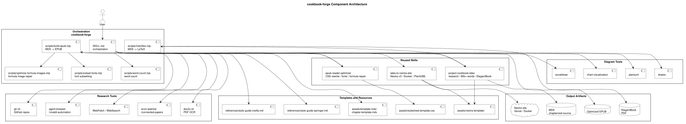
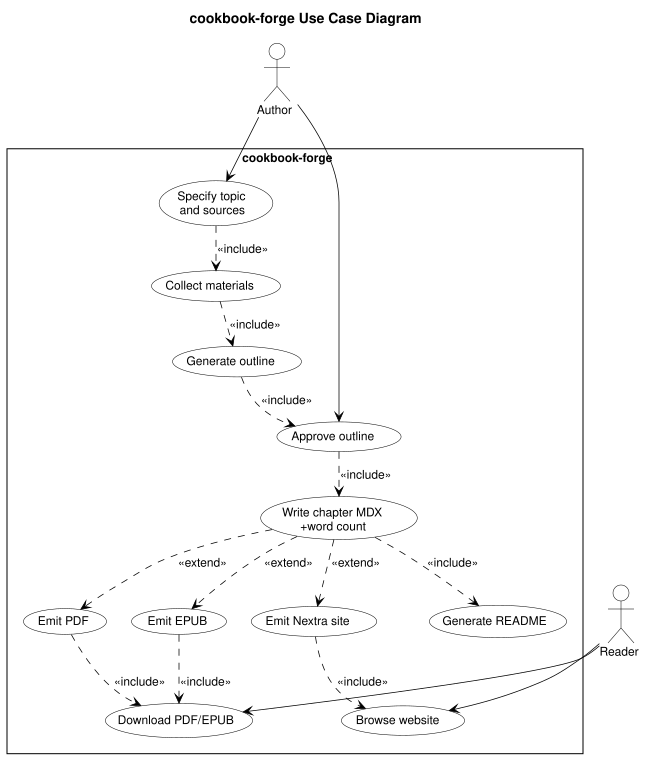
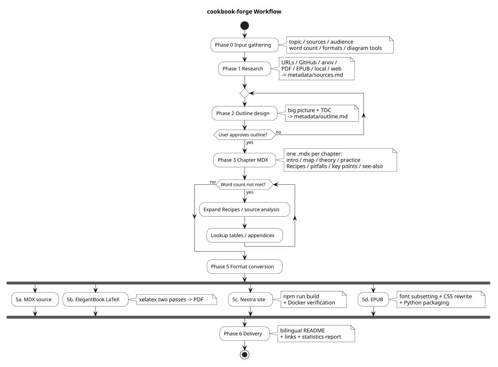

<p align="center">
  
</p>

<h1 align="center">Cookbook Forge</h1>

<p align="center">
  <strong>cookbook-forge</strong> — Domain CookBook / Handbook / Survey generator
</p>

<p align="center">
  From multi-source materials to chapterized MDX, then ElegantBook PDF,<br>
  Nextra website, optimized EPUB, and Typst PDF - all in O'Reilly CookBook and Springer Handbook style.
</p>

---

## What It Is

`cookbook-forge` is an orchestrating Skill that produces a complete, in-depth technical book from a user's natural-language request and assorted source materials (web pages, PDFs, EPUBs, GitHub repos, arxiv papers, project docs, etc.).

It consolidates the core capabilities of three pre-existing Skills:

- **project-cookbook-latex** — exhaustive research, source-level analysis, 80k+ word structure, ElegantBook typography, PDF quality gates
- **latex-to-nextra-site** — Nextra v3 site scaffolding, Docker deployment, chapter renumbering, PlantUML/Drawio rendering, MDX conversion
- **epub-reader-optimizer** — EPUB CSS rewriting, font subsetting & embedding, formula-as-image HTML repair, spec-compliant packaging

## What It Does

- 📚 Generates CookBooks / handbooks / surveys on any technical domain
- 🔍 Multi-source research: web scraping (including sitemaps), GitHub repos, arxiv papers, PDF OCR, EPUB unpacking, local source/docs, web search
- 🔍 **Paper search**: supports `paper-search` (MCP) to search 20+ sources (arXiv, PubMed, Semantic Scholar, etc.)
- 🏛️ Architecture-first: produces a full map and chapter outline, aligns with the user, then writes chapter-by-chapter
- 📝 MDX as the canonical intermediate format: one `.mdx` per chapter for easy conversion to any downstream format
- 🎨 Rich figures: mermaid / plantuml / drawio / excalidraw / chart, chosen based on user preference
- 📖 Four output formats (combinable):
  - **MDX** (default): chapterized Markdown + JSX, the source format
  - **ElegantBook LaTeX + PDF**: built on [ElegantLaTeX/ElegantBook](https://github.com/ElegantLaTeX/ElegantBook), compiled with xelatex
  - **Nextra v3 website**: built on [Nextra](https://nextra.site), with dark mode, full-text search, i18n, KaTeX, one-click Vercel/Docker deploy
  - **Optimized EPUB**: subset-embedded LXGW WenKai, booktabs tables, tcolorbox-style code blocks, compatible with legacy e-readers
  - **Typst PDF**: built on [ilm](https://typst.app/universe/package/ilm) template, LXGW WenKai CJK fonts, four-color callout boxes, booktabs tables, rounded code blocks
- 🌏 Auto-generates bilingual (Chinese/English) README for the produced book project

## When to Use

Invoke when the user asks to:

- "Write a CookBook / handbook / survey / technical book about X"
- Consolidate assorted materials (web pages, PDFs, GitHub repos) into a multi-chapter long-form document
- Output any combination of PDF, online website, or EPUB
- Explicitly wants O'Reilly CookBook or Springer Handbook style

## Directory Layout

```
cookbook-forge/
├── SKILL.md                              # Main skill file (orchestration instructions)
├── README.md                             # Chinese readme
├── README.en.md                          # English readme (this file)
├── scripts/
│   ├── lib/
│   │   ├── diagram-renderer.mjs          # Unified diagram rendering pipeline (mermaid/plantuml -> Kroki SVG)
│   │   └── mdx-utils.mjs                 # MDX frontmatter parser
│   ├── lmdx2tex.mjs                      # LLM-driven MDX -> ElegantBook LaTeX converter
│   ├── lmdx2typst.mjs                    # LLM-driven MDX -> Typst (ilm template) converter
│   ├── lbuild-epub.mjs                   # LLM-driven MDX -> EPUB3 converter
│   ├── render-diagrams.mjs               # Diagram renderer (mermaid/plantuml -> SVG)
│   ├── word-count.mjs                    # Word count
│   ├── epub-zip.mjs                      # EPUB-compliant packager
│   ├── subset-fonts.mjs                  # Font subsetting
│   ├── optimize-formula-images.mjs       # Formula image repair
│   ├── kroki-render.mjs                  # PlantUML Kroki rendering
│   └── build-skill.mjs                   # Skill packaging script
├── references/
│   ├── style-guide-oreilly.md            # O'Reilly CookBook style reference
│   ├── style-guide-springer.md           # Springer Handbook style reference
│   ├── stage-5a-mdx.md                   # Stage 5a: MDX output sub-process
│   ├── stage-5b-latex.md                 # Stage 5b: LaTeX + PDF sub-process
│   ├── stage-5c-nextra.md                # Stage 5c: Nextra site sub-process
│   ├── stage-5d-epub.md                  # Stage 5d: EPUB sub-process
│   └── stage-5e-typst.md                 # Stage 5e: Typst sub-process
└── assets/
    ├── prompts/
    │   ├── mdx-to-latex.md               # MDX->LaTeX conversion prompt
    │   ├── mdx-to-epub.md                # MDX->EPUB XHTML conversion prompt
    │   └── mdx-to-typst.md               # MDX->Typst conversion prompt
    ├── template-mdx/
    │   └── chapter-template.mdx          # Per-chapter MDX template
    ├── nextra-template/                  # Nextra site scaffold
    ├── elegantbook-main.template.tex.txt # ElegantBook LaTeX template
    ├── ilm-template.typ.txt              # Typst ilm template (optimized styles)
    ├── stylesheet.template.css           # EPUB base CSS
    └── stylesheet.formula-image.css      # CSS for formula-as-image EPUBs
```

## Component Architecture



## Use Case Diagram



## Workflow Overview



<details>
<summary>Textual workflow</summary>

```
Phase 0  Input gathering  → topic / sources / audience / word count / formats / diagram tools
Phase 1  Research         → URLs / GitHub / arxiv / PDF / EPUB / local / web → metadata/sources.md
Phase 2  Outline          → big picture + TOC → metadata/outline.md ⚠️ must get user approval
Phase 3  Chapter MDX      → one .mdx per chapter: intro / map / theory / practice / Recipes / pitfalls / key points / see-also
Phase 4  Word count       → expand via Recipes / source analysis / lookup tables / appendices until target met
Phase 5  Format conversion (sub-agent checks & fixes after each format)
  5a.  MDX               (default)
  5b.  ElegantBook       -> xelatex (two passes) -> PDF
  5c.  Nextra site       -> npm run build + Docker verification
  5d.  EPUB              -> font subsetting + CSS rewrite + Python packaging
  5e.  Typst             -> ilm template + typst compile -> PDF
Phase 6  Delivery         → bilingual README + links + statistics report
```

</details>

## Dependent Skills / Tools

Orchestrated on demand:

- `agent-browser` / `vivaldi-automation` — web scraping and sitemap traversal
- `WebFetch` / `WebSearch` — web content fetching
- `arxiv-watcher` / `connected-papers-browser` - paper retrieval
- `paper-search` (MCP) - paper search (arXiv, PubMed, Semantic Scholar, 20+ sources)
- `doc2x-cli` — PDF OCR / parsing
- `gh-cli` — GitHub repo reading
- `plantuml` / `drawio` / `excalidraw` / `chart-visualization` — diagram generation
- `elegantbook-latex` - LaTeX typography optimization
- Typst CLI (for Typst PDF, only when Typst output is requested)
- Node.js ≥ 18.17 (Nextra build / EPUB packaging / font subsetting)
- Optional: `fonteditor-core` (`npm install fonteditor-core` for font subsetting; if missing, script prints install hint + Python fonttools fallback)
- Docker (for PlantUML rendering and Nextra deployment verification)
- XeLaTeX (for ElegantBook PDF, only when PDF output is requested)
- Python 3 (only as font-subsetting fallback, not required)

## Quality Gates

Before delivery:

- [ ] Outline approved by the user
- [ ] One MDX per chapter with complete frontmatter; includes intro / map / key points / see-also
- [ ] All code blocks have language tags and Chinese comments
- [ ] All figures have number, caption, in-text reference, and explanatory paragraph
- [ ] Cross-chapter references are clickable links
- [ ] Word target met, or gap explicitly documented
- [ ] PDF: xelatex builds clean; cover 1280×1024 non-empty; no Markdown residue
- [ ] Nextra: `npm run build` passes; Docker healthy; `/zh` returns 200
- [ ] EPUB: mimetype first & STORED; fonts subset-embedded; CSS effective
- [ ] Typst: typst compile zero errors; no Markdown/LaTeX syntax residue; CJK fonts configured
- [ ] Diagrams: source preserved in diagrams-src/, rendered output in figures/

## Publishing to SkillHub

This Skill directory follows the [SkillHub publishing spec](https://skillhub.cn/tutorials#publish-manage-skill):

- ✅ Root-level `SKILL.md` with frontmatter (`name`, `slug`, `displayName`, `version`, `license`, `summary`, `description`, `tags`)
- ✅ `scripts/` executable scripts (`.mjs`)
- ✅ `references/` lazily-loaded reference docs (style guides)
- ✅ `assets/` templates and resources (logo, diagrams, MDX template, Nextra scaffold, CSS)
- ✅ Bilingual `README.md` / `README.en.md`

Publish via CLI:

```bash
skillhub publish ./cookbook-forge --changelog "Initial release"
```

## License

MIT
