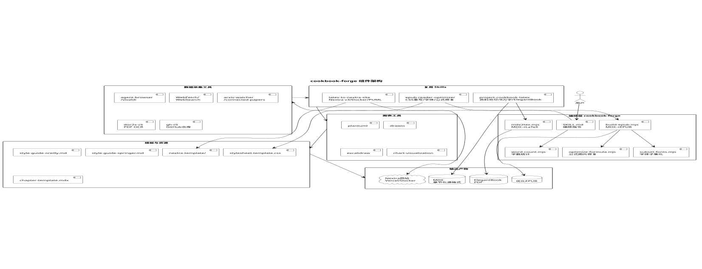
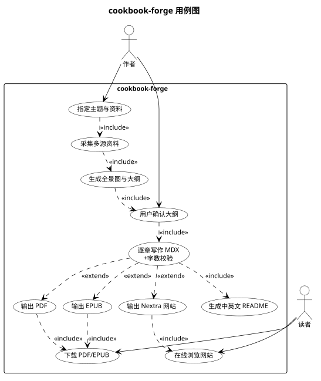
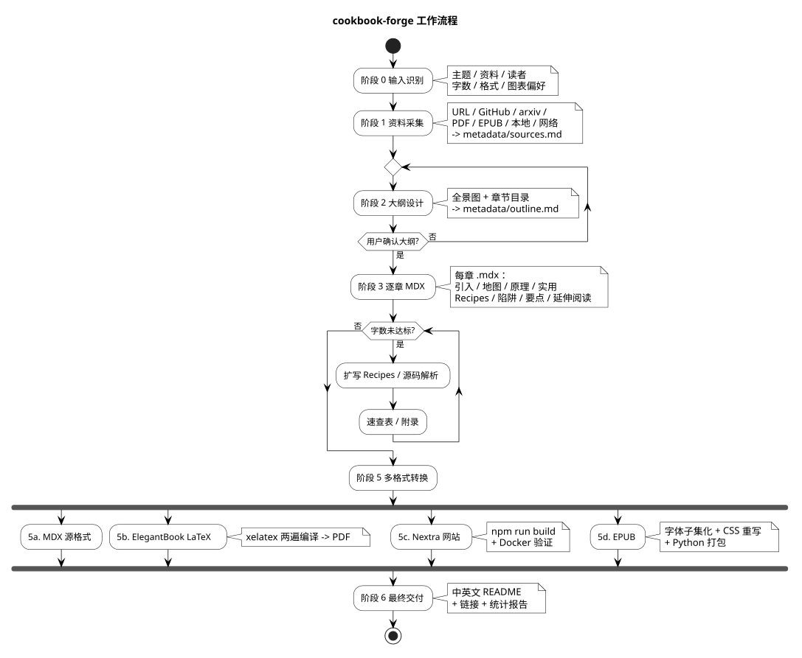

<p align="center">
  
</p>

<h1 align="center">Cookbook Forge</h1>

<p align="center">
  <strong>cookbook-forge</strong> — 领域 CookBook / Handbook / Survey 生成器
</p>

<p align="center">
  从多源资料出发，按 O'Reilly CookBook 与 Springer Handbook 风格，<br>
  先生成章节化 MDX，再转换为 ElegantBook PDF、Nextra 网站、优化 EPUB、Typst PDF。
</p>

---

## 这是什么

`cookbook-forge` 是一个编排型 Skill，用于根据用户提供的自然语言需求与多种资料源（网页、PDF、EPUB、GitHub 仓库、arxiv 论文、项目文档等），生成一本结构完整、内容深入的技术书籍。

它组合并吸收了三个既有 Skill 的核心能力：

- **project-cookbook-latex**：资料穷尽、源码级分析、8 万字长文结构、ElegantBook 排版规范、PDF 质量闸门
- **latex-to-nextra-site**：Nextra v3 站点工程、Docker 部署、章节重编号、PlantUML/Drawio 渲染、MDX 转换
- **epub-reader-optimizer**：EPUB CSS 重写、字体子集化嵌入、公式图片修复、合规打包

## 能做什么

- 📚 **生成任意技术领域的 CookBook / 手册 / 综述**
- 🔍 **多源资料采集**：网页爬取（含 sitemap）、GitHub 仓库、arxiv 论文、PDF OCR、EPUB 解包、本地源码/文档、网络搜索
- 🔍 **论文搜索**：支持 `paper-search`（MCP）从 arXiv、PubMed、Semantic Scholar 等 20+ 来源搜索论文
- 🏛️ **架构先行**：先生成整体全景图与章节大纲，与用户对齐后再逐章写作
- 📝 **MDX 为权威中间格式**：每章一个 `.mdx`，便于后续多格式转换
- 🎨 **丰富图表**：mermaid / plantuml / drawio / excalidraw / chart，按用户偏好选用
- 📖 **四种最终输出格式**（可组合）：
  - **MDX**（默认）：章节化 Markdown + JSX，适合作为源格式
  - **ElegantBook LaTeX + PDF**：基于 [ElegantLaTeX/ElegantBook](https://github.com/ElegantLaTeX/ElegantBook)，xelatex 编译
  - **Nextra v3 网站**：基于 [Nextra](https://nextra.site)，支持明暗模式、全文搜索、i18n、KaTeX、一键 Vercel/Docker 部署
  - **优化 EPUB**：LXGW WenKai 子集化嵌入、booktabs 表格、tcolorbox 风格代码块、兼容老旧阅读器
  - **Typst PDF**：基于 [ilm](https://typst.app/universe/package/ilm) 模板，LXGW WenKai 中文字体、四色 callout 提示框、booktabs 表格、代码块圆角边框
- 🌏 **中英文 README 自动生成**（书籍项目自带）

## 何时使用

当用户提出以下任一需求时调用：

- "帮我写一本关于 X 的 CookBook / 手册 / 综述 / 技术书"
- 提供多种资料（网页、PDF、GitHub 仓库）要求整理为**多章长文**
- 要求输出 PDF、在线网站、EPUB 中的任一或多个
- 明确提到参考 O'Reilly CookBook 或 Springer Handbook 风格

## 目录结构

```
cookbook-forge/
├── SKILL.md                              # Skill 主文件（编排指令）
├── README.md                             # 中文说明（本文件）
├── README.en.md                          # 英文说明
├── scripts/
│   ├── lib/
│   │   ├── diagram-renderer.mjs          # 统一图表渲染 pipeline（mermaid/plantuml -> Kroki SVG）
│   │   └── mdx-utils.mjs                 # MDX frontmatter 解析工具
│   ├── lmdx2tex.mjs                      # LLM 驱动 MDX -> ElegantBook LaTeX 转换
│   ├── lmdx2typst.mjs                    # LLM 驱动 MDX -> Typst（ilm 模板）转换
│   ├── lbuild-epub.mjs                   # LLM 驱动 MDX -> EPUB3 转换
│   ├── render-diagrams.mjs               # 图表渲染（mermaid/plantuml -> SVG）
│   ├── word-count.mjs                    # 字数统计
│   ├── epub-zip.mjs                      # EPUB 合规打包
│   ├── subset-fonts.mjs                  # 字体子集化
│   ├── optimize-formula-images.mjs       # 公式图片修复
│   ├── kroki-render.mjs                  # PlantUML Kroki 渲染
│   └── build-skill.mjs                   # Skill 打包脚本
├── references/
│   ├── style-guide-oreilly.md            # O'Reilly CookBook 写作风格参考
│   ├── style-guide-springer.md           # Springer Handbook 写作风格参考
│   ├── stage-5a-mdx.md                   # 阶段 5a：MDX 输出子流程
│   ├── stage-5b-latex.md                 # 阶段 5b：LaTeX + PDF 子流程
│   ├── stage-5c-nextra.md                # 阶段 5c：Nextra 网站子流程
│   ├── stage-5d-epub.md                  # 阶段 5d：EPUB 子流程
│   └── stage-5e-typst.md                 # 阶段 5e：Typst 子流程
└── assets/
    ├── prompts/
    │   ├── mdx-to-latex.md               # MDX->LaTeX 转换 Prompt
    │   ├── mdx-to-epub.md                # MDX->EPUB XHTML 转换 Prompt
    │   └── mdx-to-typst.md               # MDX->Typst 转换 Prompt
    ├── template-mdx/
    │   └── chapter-template.mdx          # 单章 MDX 写作模板
    ├── nextra-template/                  # Nextra 站点骨架
    ├── elegantbook-main.template.tex.txt # ElegantBook LaTeX 模板
    ├── ilm-template.typ.txt              # Typst ilm 模板（优化样式）
    ├── stylesheet.template.css           # EPUB 基础 CSS
    └── stylesheet.formula-image.css      # 公式图片型 EPUB CSS
```

## 组件架构



## 用例图



## 工作流程概览



<details>
<summary>文字版流程</summary>

```
阶段 0  输入识别     → 主题/资料/读者/字数/格式/图表偏好
阶段 1  资料采集     → URL/GitHub/arxiv/PDF/EPUB/本地/网络补充 → metadata/sources.md
阶段 2  大纲设计     → 全景图 + 章节目录 → metadata/outline.md ⚠️ 必须用户确认
阶段 3  逐章 MDX     → 每章 .mdx：引入/地图/原理/实用/Recipes/陷阱/要点/延伸阅读
阶段 4  字数统计     → 不足则扩写 Recipes/源码解析/速查表/附录
阶段 5  多格式转换（每种格式生成后子 agent 检查修复）
  5a.  MDX          （默认）
  5b.  ElegantBook  -> xelatex 两遍编译 -> PDF
  5c.  Nextra 网站  -> npm run build + Docker 验证
  5d.  EPUB         -> 字体子集化 + CSS 重写 + Python 打包
  5e.  Typst        -> ilm 模板 + typst compile -> PDF
阶段 6  最终交付     → 中英文 README + 链接 + 统计报告
```

</details>

## 依赖的 Skills / 工具

执行时按需联动：

- `agent-browser` / `vivaldi-automation`：网页爬取与站点地图遍历
- `WebFetch` / `WebSearch`：网络资料抓取
- `arxiv-watcher` / `connected-papers-browser`：论文检索
- `paper-search`（MCP）：论文搜索（arXiv、PubMed、Semantic Scholar 等 20+ 来源）
- `doc2x-cli`：PDF OCR / 解析
- `gh-cli`：GitHub 仓库读取
- `plantuml` / `drawio` / `excalidraw` / `chart-visualization`：图表生成
- `elegantbook-latex`：LaTeX 排版优化
- Typst CLI（用于 Typst PDF 编译，仅在需要 Typst 输出时）
- Node.js ≥ 18.17（Nextra 构建 / EPUB 打包 / 字体子集化）
- 可选：`fonteditor-core`（`npm install fonteditor-core`，用于字体子集化；若未安装，脚本会提示并给出 Python fonttools fallback）
- Docker（用于 PlantUML 渲染和 Nextra 部署验证）
- XeLaTeX（用于 ElegantBook PDF 编译，仅在需要 PDF 输出时）
- Python 3（仅作为字体子集化 fallback，非必需）

## 质量闸门

交付前必须通过：

- [ ] 大纲已与用户对齐
- [ ] 每章一个 MDX，frontmatter 完整，含引入/地图/要点/延伸阅读
- [ ] 代码块全部带语言标识 + 中文注释
- [ ] 图表有编号、标题、正文引用、说明段落
- [ ] 跨章引用为可点击链接
- [ ] 字数达标或明确说明缺口
- [ ] PDF：xelatex 编译通过；封面 1280×1024 非空；无 Markdown 残留
- [ ] Nextra：`npm run build` 通过；Docker healthy；`/zh` 200
- [ ] EPUB：mimetype 第一且 STORED；字体子集化嵌入；CSS 生效
- [ ] Typst：typst compile 零 error；无 Markdown/LaTeX 语法残留；中文字体正确配置
- [ ] 图表：原始源码保留在 diagrams-src/，渲染产物在 figures/

## 安装与发布

### 通过 skills.sh 安装

```bash
npx skills samonysh/cookbook-forge
```

### 通过 SkillHub 发布

本 Skill 目录结构符合 [SkillHub 发布规范](https://skillhub.cn/tutorials#publish-manage-skill)：

- ✅ 根目录 `SKILL.md`（含 `name` / `slug` / `displayName` / `version` / `license` / `summary` / `description` / `tags` 等 frontmatter）
- ✅ `scripts/` 可执行脚本（`.mjs`）
- ✅ `references/` 按需加载的参考文档（写作风格指南 + 阶段 5 子流程）
- ✅ `assets/` 模板与资源文件（Prompts、MDX 模板、Nextra 骨架、CSS、Typst 模板）
- ✅ 中英文 `README.md` / `README.en.md`

打包发布：

```bash
node scripts/build-skill.mjs          # 生成 dist/cookbook-forge-1.3.0.zip
skillhub publish ./cookbook-forge --changelog "v1.3.0: 新增 Typst 输出、图表双格式、阶段5分拆、质量检查"
```

## License

MIT
