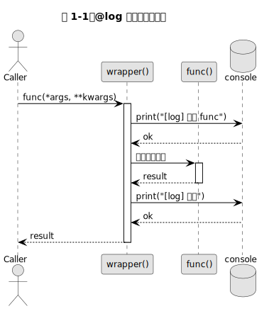

<div className="callout chapteroutline">

#### 📘 本章地图

本章解决三个问题：为什么装饰器能成立（一等函数 + 闭包）？`@` 到底是什么语法？如何写第一个装饰器？

- [1.1 函数是一等公民](#11-函数是一等公民)
- [1.2 闭包：内部函数记住环境](#12-闭包内部函数记住环境)
- [1.3 `@` 语法糖：`f = deco(f)`](#13--语法糖f--decof)
- [1.4 Recipe：计时器装饰器](#14-recipe计时器装饰器)
- [1.5 常见陷阱](#15-常见陷阱)
- [1.6 要点总结](#16-要点总结)

</div>

## 1.1 函数是一等公民

"一等公民"（first-class citizen）意味着函数可以：

1. 赋值给变量
2. 作为参数传给另一个函数
3. 作为另一个函数的返回值

```python
# file: examples/first_class.py
def greet(name: str) -> str:
    """返回一条问候语。"""
    return f"Hello, {name}!"

# 1) 赋值给变量
say_hello = greet
print(say_hello("Alice"))  # Hello, Alice!

# 2) 作为参数传入高阶函数
def shout(fn, text: str) -> str:
    """调用 fn(text) 并把结果转为大写。"""
    return fn(text).upper()

print(shout(greet, "bob"))  # HELLO, BOB!
```

这三条性质是所有装饰器的"地基"。没有一等函数，装饰器根本无从谈起。

## 1.2 闭包：内部函数记住环境

**闭包**（closure）是指：一个内部函数引用了外部函数的局部变量，即使外部函数已经返回，内部函数仍然能访问这些变量。

```python
# file: examples/closure.py
def make_counter() -> callable:
    """返回一个闭包：每次调用计数 +1。"""
    count = 0  # 这个变量被闭包"记住"

    def increment() -> int:
        # nonlocal 告诉 Python：count 来自外层作用域
        nonlocal count
        count += 1
        return count

    return increment

# 调用：counter 就是 increment，却记住了 count
counter = make_counter()
print(counter())  # 1
print(counter())  # 2
print(counter())  # 3
```

关键点：`counter()` 每次都能读到自己那份 `count`，即使 `make_counter` 早已执行完毕。装饰器就是"带额外行为的闭包"。

## 1.3 `@` 语法糖：`f = deco(f)`

PEP 318 引入的 `@` 语法只是**语法糖**（syntactic sugar）。下面两种写法**完全等价**：

```python
# 写法 A：语法糖
@log
def hello(name):
    return f"hi {name}"

# 写法 B：手动调用
def hello(name):
    return f"hi {name}"
hello = log(hello)
```

也就是说，装饰器是一个**输入为函数、输出为另一个函数**的高阶函数：

$$T: f \mapsto f'$$

其中 $f'$ 通常是一个"包裹了 $f$ 的 wrapper"。

### 最小可用装饰器

```python
# file: examples/log_deco.py
import functools

def log(func):
    """打印函数调用日志的装饰器。"""

    # functools.wraps 拷贝原函数的 __name__、__doc__ 等元信息
    @functools.wraps(func)
    def wrapper(*args, **kwargs):
        print(f"[log] 调用 {func.__name__}, args={args}, kwargs={kwargs}")
        result = func(*args, **kwargs)  # 调用原函数
        print(f"[log] {func.__name__} 返回 {result!r}")
        return result

    return wrapper

@log
def add(a: int, b: int) -> int:
    return a + b

add(2, 3)
# [log] 调用 add, args=(2, 3), kwargs={}
# [log] add 返回 5
```

图 1-1 是 `@log` 装饰器的调用时序：



如图所示，每次调用 `add(2, 3)` 实际上进入的是 `wrapper`，它先打日志、再调原函数、最后返回结果。

### 装饰器 vs 普通函数

| 维度 | 普通函数 | 装饰器 |
|---|---|---|
| 输入 | 数据 | **另一个函数** |
| 输出 | 数据 | **包裹后的函数** |
| 用法 | `result = f(x)` | `f = deco(f)`（或 `@deco`） |
| 典型场景 | 业务逻辑 | 横切关注点：日志/缓存/权限 |

## 1.4 Recipe：计时器装饰器

<div className="callout recipe">

#### 🍳 Recipe 1-1：测量函数耗时

**Problem**：想知道一个函数运行了多久，又不想把计时代码散落到每处调用。

**Solution**：

```python
# file: recipes/timer.py
import time
import functools

def timer(func):
    @functools.wraps(func)
    def wrapper(*args, **kwargs):
        t0 = time.perf_counter()       # 开始计时（高精度）
        try:
            return func(*args, **kwargs)
        finally:
            dt = time.perf_counter() - t0
            print(f"[timer] {func.__name__} 耗时 {dt*1000:.2f} ms")
    return wrapper

@timer
def slow_sum(n: int) -> int:
    return sum(range(n))

slow_sum(10_000_000)  # [timer] slow_sum 耗时 253.47 ms
```

**Discussion**：

- 用 `try/finally` 保证即使函数抛异常也会打印耗时。
- `time.perf_counter()` 是 Python 推荐的短时计时 API（比 `time.time()` 精度更高，且不受系统时钟回拨影响）。

**See Also**：第 2 章将把它升级为带参数的 `@timer(unit="ms")`。

</div>

## 1.5 常见陷阱

<div className="callout pitfall">

#### ⚠️ 陷阱 1：忘记 `@functools.wraps(func)`

如果不加 `@functools.wraps(func)`，装饰后的函数会丢失原函数的元信息：

```python
@log
def add(a, b):
    """两个整数相加。"""
    return a + b

print(add.__name__)  # 没有 wraps → "wrapper"，加了 wraps → "add"
print(add.__doc__)   # 没有 wraps → None，加了 wraps → "两个整数相加。"
```

这会破坏调试器、文档生成工具（Sphinx）、以及依赖 `__name__` 的框架（如 Flask 路由注册）。

**正确做法**：**永远**在 wrapper 上加 `@functools.wraps(func)`。

</div>

## 1.6 要点总结

<div className="callout keypoints">

#### ✅ 核心要点

- 装饰器的前提是**函数是一等公民** + **闭包**。
- `@deco` 只是 `f = deco(f)` 的语法糖。
- 一个合格的装饰器必须用 `@functools.wraps(func)` 保留原函数元信息。
- wrapper 用 `*args, **kwargs` 才能适配任意签名的被装饰函数。
- 装饰器是**横切关注点**（日志、计时、权限、缓存）的首选表达。

</div>

## 1.7 延伸阅读

- [第 2 章 · 进阶装饰器](./ch02-advanced.mdx)：带参装饰器、类装饰器、堆叠顺序
- [附录 A · functools 速查](./appendix-a.mdx)
- PEP 318 – Decorators for Functions and Methods：https://peps.python.org/pep-0318/

---

**本章参考文献**

1. Python Software Foundation. "PEP 318 – Decorators for Functions and Methods." https://peps.python.org/pep-0318/
2. Real Python. "Primer on Python Decorators." https://realpython.com/primer-on-python-decorators/
