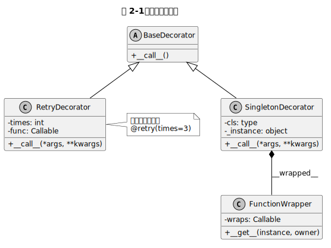

<div className="callout chapteroutline">

#### 📘 本章地图

第 1 章的装饰器只能"裸用"（`@log`）。本章学会带参数的装饰器、装饰类的装饰器，以及多个装饰器堆叠时的执行顺序。

- [2.1 带参装饰器：为什么多一层函数](#21-带参装饰器为什么多一层函数)
- [2.2 Recipe：@retry(times=N)](#22-reciperetrytimesn)
- [2.3 类装饰器：装饰整个类](#23-类装饰器装饰整个类)
- [2.4 装饰器堆叠：自下而上应用](#24-装饰器堆叠自下而上应用)
- [2.5 常见陷阱](#25-常见陷阱)
- [2.6 要点总结](#26-要点总结)

</div>

## 2.1 带参装饰器：为什么多一层函数

第 1 章的 `@log` 写死了行为。如果想 `@retry(times=3)` 这样**带参数**，必须多包一层函数：

```python
# 不带参：@deco           → deco(func) 返回 wrapper
# 带参：  @deco(times=3)  → deco(times=3)(func) 返回 wrapper
```

也就是说，带参装饰器是**返回真正装饰器的工厂**。通用模板：

```python
def deco_factory(params):
    """外层：接收装饰器参数，返回真正的装饰器。"""
    def real_decorator(func):
        """中层：真正的装饰器，输入 func，输出 wrapper。"""
        @functools.wraps(func)
        def wrapper(*args, **kwargs):
            """内层：被装饰后的函数。"""
            ...  # 可以使用 params、func
        return wrapper
    return real_decorator
```

函数嵌套三层，理解关键是：**每次 `@deco(...)` 先执行 `deco(...)`，把结果当装饰器用。**

## 2.2 Recipe：@retry(times=N)

<div className="callout recipe">

#### 🍳 Recipe 2-1：失败自动重试

**Problem**：调用不稳定的外部 API 时，想自动重试 N 次再放弃。

**Solution**：

```python
# file: recipes/retry.py
import time
import functools

def retry(times: int = 3, delay: float = 0.5):
    """失败重试装饰器。

    Args:
        times: 最大重试次数（含首次调用）。
        delay: 每次重试前等待的秒数，避免雪崩。
    """
    def decorator(func):
        @functools.wraps(func)
        def wrapper(*args, **kwargs):
            last_exc = None
            for attempt in range(1, times + 1):
                try:
                    return func(*args, **kwargs)
                except Exception as exc:
                    last_exc = exc
                    print(f"[retry] 第 {attempt}/{times} 次失败：{exc}")
                    if attempt < times:
                        time.sleep(delay)  # 退避等待
            # 全部失败，向外抛出最后一次异常
            raise last_exc
        return wrapper
    return decorator

import random

@retry(times=3, delay=0.1)
def flaky_api() -> str:
    if random.random() < 0.7:
        raise ConnectionError("网络抖动")
    return "ok"

print(flaky_api())
```

**Discussion**：

- 三层嵌套对应 `retry(times=3)(func)(args)`。
- 用 `time.sleep(delay)` 做简单退避；生产环境建议**指数退避**（exponential backoff）。
- 最后一次重试失败才 `raise`，中间失败只打印日志。

</div>

## 2.3 类装饰器：装饰整个类

装饰器不仅能装饰函数，也能装饰**类**。最常见的用途：

- 给类自动注册到某个全局表（如 ORM 模型、插件系统）
- 把类改造为单例（singleton）
- 自动给类加方法/属性

```python
# file: examples/singleton.py
import functools

def singleton(cls):
    """把类改造成单例：cls() 永远返回同一个实例。"""
    _instances = {}

    @functools.wraps(cls, updated=())
    def wrapper(*args, **kwargs):
        if cls not in _instances:
            _instances[cls] = cls(*args, **kwargs)
        return _instances[cls]

    return wrapper

@singleton
class AppConfig:
    def __init__(self):
        self.env = "production"

a = AppConfig()
b = AppConfig()
assert a is b  # True，同一个实例
```

图 2-1 展示了装饰器相关类之间的继承与组合关系：



注意：类装饰器接收的参数是 **类对象本身**（而不是类的某个实例）。

## 2.4 装饰器堆叠：自下而上应用

多个装饰器可以堆叠在同一个函数上：

```python
@timer
@retry(times=3)
@log
def fetch(url): ...
```

**执行顺序**规则只有一句话：**离函数最近的装饰器最先应用（自下而上）**。

上面的例子等价于：

```python
fetch = timer(retry(times=3)(log(fetch)))
```

应用顺序是 `log → retry → timer`；而**执行顺序**（调用 `fetch()` 时 wrapper 的堆叠顺序）正好相反：`timer → retry → log → 原 fetch`。

记忆法：**装饰像洋葱，外到内层层包裹**。

### 装饰器类型速查

| 类型 | 语法 | 层数 | 典型场景 |
|---|---|---|---|
| 无参函数装饰器 | `@deco` | 2 层 | `@log`, `@timer` |
| 带参函数装饰器 | `@deco(x=1)` | 3 层 | `@retry(times=3)`, `@lru_cache(maxsize=64)` |
| 类装饰器 | `@deco` 在 `class` 上 | 2 层 | `@singleton`, `@dataclass` |
| 堆叠装饰器 | 多个 `@` | 多套 | 组合日志+重试+计时 |

## 2.5 常见陷阱

<div className="callout pitfall">

#### ⚠️ 陷阱 2：装饰器堆叠顺序写反导致行为错乱

```python
@log        # 外层
@retry(3)   # 内层
def api(): ...
```

如果你期望"每次重试都打日志"，这个顺序是对的（外层 log 包裹整个 retry 循环，只会打一次）。如果你期望"每次尝试都打日志"，必须把 `@log` 写在 `@retry` **里面**：

```python
@retry(3)
@log
def api(): ...
```

**规则**：想让某个 wrapper 对"每次重试"生效，就让它更靠近被装饰函数。

#### ⚠️ 陷阱 3：类装饰器忘记保留类元信息

装饰类时 `functools.wraps(cls)` 默认不会复制类的 `__doc__`/`__name__`，需要加 `updated=()` 参数：

```python
@functools.wraps(cls, updated=())
def wrapper(*args, **kwargs): ...
```

</div>

## 2.6 要点总结

<div className="callout keypoints">

#### ✅ 核心要点

- 带参装饰器 = "返回装饰器的工厂"，**三层嵌套**：工厂 → 装饰器 → wrapper。
- 类装饰器接收**类对象**，常见用途是单例、注册、改造类。
- 多个装饰器堆叠：**自下而上**应用（离函数最近最先执行装饰），运行时**外→内**包裹。
- 用 `functools.wraps` 保留元信息；装饰类时加 `updated=()`。

</div>

行内公式示例：装饰器的数学抽象是 $T: f \mapsto f'$，其中 $f'$ 是 wrapper。

块级公式示例：带参装饰器的三次调用可以写成：

$$
D(a, b)(f)(x) = W_{a,b}\bigl(f(x)\bigr)
$$

## 2.7 延伸阅读

- [第 1 章 · 装饰器基础](./ch01-basics.mdx)
- [附录 A · functools 速查](./appendix-a.mdx)
- Python 官方文档 `functools`：https://docs.python.org/3/library/functools.html

---

**本章参考文献**

1. Python Software Foundation. "functools — Higher-order functions and operations on callable objects." https://docs.python.org/3/library/functools.html
