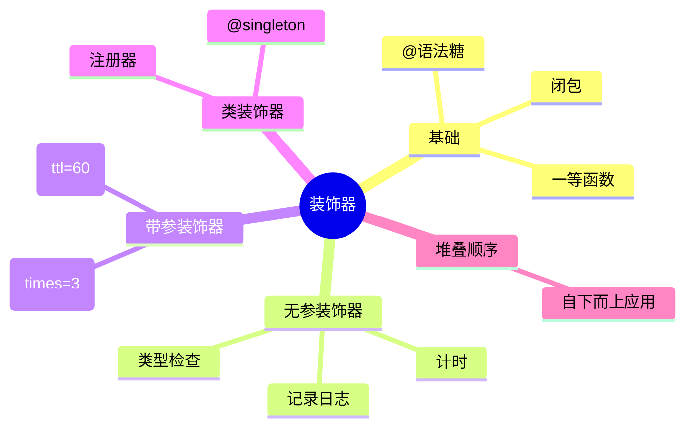

# Python 装饰器 CookBook

#### 📘 本册地图

本 CookBook 面向中级 Python 开发者，系统讲解装饰器（Decorator）这一元编程核心工具。

- [第 1 章 · 装饰器基础](./ch01-basics.mdx)：闭包、`@` 语法糖、无参装饰器
- [第 2 章 · 进阶装饰器](./ch02-advanced.mdx)：带参装饰器、类装饰器、装饰器堆叠
- [附录 A · functools 速查](./appendix-a.mdx)

## 为什么要学装饰器

装饰器是 Python 中最具"Pythonic"风格的语言特性之一。从 Web 框架（Flask 的 `@app.route`、FastAPI 的 `@app.get`）到权限校验、日志记录、缓存、重试，几乎所有横切关注点（cross-cutting concern）都可以用装饰器优雅地表达。

理解装饰器不仅是会写 `@xxx`，更要理解：

- **函数是一等公民**（first-class citizen）：函数可以作为参数、返回值、赋值给变量。
- **闭包**（closure）：内部函数记住外部函数的词法环境。
- **语法糖只是函数调用**：`@deco` 本质上是 `f = deco(f)`。

## 全景图

> 上面这张心智图（mindmap）覆盖了本册的全部知识点。建议先通览，再进入第 1 章。

## 目标读者

- 已经会写 Python 函数与类，读过至少一份 Python 项目源码
- 想系统理解 `@decorator` 的内部机理，而不是只会复制粘贴
- 目标：能写出可复用、可维护、可调试的装饰器

## 约定

- 所有示例基于 **Python 3.10+**（使用 PEP 604 的 `X | Y` 类型注解语法）。
- 代码块标注文件路径，可直接复制运行。
- 每章末尾的 **Recipes** 提供任务导向示例；**Pitfalls** 列出常见坑。
